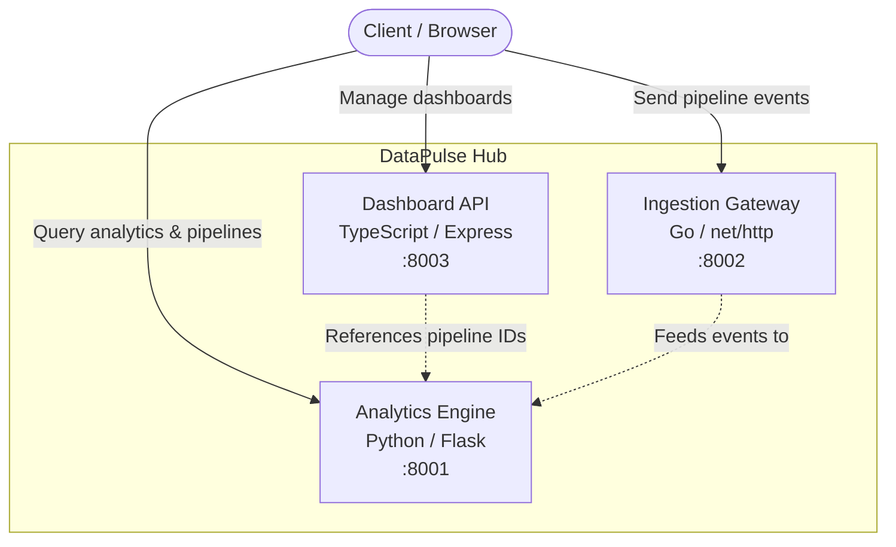

# DataPulse Hub

Real-time data pipeline monitoring and analytics platform built with a microservices architecture using Python, Go, and TypeScript.

## Architecture



## Services

| Service | Language | Port | Description |
|---------|----------|------|-------------|
| **Analytics Engine** | Python (Flask) | 8001 | Pipeline management, event ingestion, and analytics aggregation |
| **Ingestion Gateway** | Go (net/http) | 8002 | High-performance event ingestion with in-memory storage |
| **Dashboard API** | TypeScript (Express) | 8003 | Dashboard CRUD and overview statistics |

## Quick Start

### Prerequisites

- Docker & Docker Compose
- Python 3.12+
- Go 1.22+
- Node.js 22+

### Run with Docker Compose

```bash
cp .env.example .env
make up
```

### Run Tests

```bash
make test
```

### Stop Services

```bash
make down
```

## API Reference

### Analytics Engine (`:8001`)

| Method | Endpoint | Description |
|--------|----------|-------------|
| `GET` | `/health` | Health check |
| `GET` | `/api/pipelines` | List all pipelines |
| `POST` | `/api/pipelines` | Create a pipeline (`{"id": "...", "name": "..."}`) |
| `GET` | `/api/pipelines/:id` | Get a specific pipeline |
| `POST` | `/api/pipelines/:id/ingest` | Ingest an event into a pipeline |
| `GET` | `/api/stats` | Get aggregate statistics |

### Ingestion Gateway (`:8002`)

| Method | Endpoint | Description |
|--------|----------|-------------|
| `GET` | `/health` | Health check |
| `POST` | `/api/ingest` | Ingest event (`{"pipeline_id": "...", "payload": {...}}`) |
| `GET` | `/api/events` | List events (optional `?pipeline_id=...` filter) |
| `GET` | `/api/stats` | Get event count statistics |

### Dashboard API (`:8003`)

| Method | Endpoint | Description |
|--------|----------|-------------|
| `GET` | `/health` | Health check |
| `GET` | `/api/dashboards` | List all dashboards |
| `POST` | `/api/dashboards` | Create a dashboard (`{"name": "...", "pipelineIds": [...]}`) |
| `GET` | `/api/dashboards/:id` | Get a specific dashboard |
| `DELETE` | `/api/dashboards/:id` | Delete a dashboard |
| `GET` | `/api/overview` | Get overview statistics |

## Usage Examples

```bash
# Create a pipeline
curl -X POST http://localhost:8001/api/pipelines \
  -H "Content-Type: application/json" \
  -d '{"id": "etl-sales", "name": "Sales ETL Pipeline"}'

# Ingest an event via the Ingestion Gateway
curl -X POST http://localhost:8002/api/ingest \
  -H "Content-Type: application/json" \
  -d '{"pipeline_id": "etl-sales", "payload": {"records_processed": 1500}}'

# Create a dashboard
curl -X POST http://localhost:8003/api/dashboards \
  -H "Content-Type: application/json" \
  -d '{"name": "Sales Overview", "pipelineIds": ["etl-sales"]}'

# Check service health
curl http://localhost:8001/health
curl http://localhost:8002/health
curl http://localhost:8003/health
```

## Environment Variables

| Variable | Default | Description |
|----------|---------|-------------|
| `ANALYTICS_PORT` | `8001` | Port for the Analytics Engine |
| `INGESTION_PORT` | `8002` | Port for the Ingestion Gateway |
| `DASHBOARD_PORT` | `8003` | Port for the Dashboard API |
| `LOG_LEVEL` | `INFO` | Log level (`DEBUG`, `INFO`, `WARN`, `ERROR`) |

## Makefile Targets

| Target | Description |
|--------|-------------|
| `make test` | Run all tests (Python + Go + TypeScript) |
| `make lint` | Run linters for all services |
| `make up` | Build and start all services with Docker Compose |
| `make down` | Stop all services |
| `make build` | Build Docker images |
| `make clean` | Stop services, remove volumes and images |

## CI/CD

GitHub Actions workflow (`.github/workflows/ci.yml`) runs on push/PR to `main`:
1. Python tests + flake8 lint
2. Go tests + go vet
3. TypeScript tests + ESLint
4. Docker Compose build verification

> **Note**: The `.github/workflows/ci.yml` file may need to be manually added after initial repository setup due to GitHub API restrictions on the `.github/` directory.

## Project Structure

```
datapulse-hub/
├── docker-compose.yml
├── Makefile
├── .env.example
├── .gitignore
├── .github/workflows/ci.yml
├── README.md
└── services/
    ├── analytics-engine/       # Python / Flask
    │   ├── app.py
    │   ├── requirements.txt
    │   ├── Dockerfile
    │   └── tests/
    │       └── test_app.py
    ├── ingestion-gateway/      # Go / net/http
    │   ├── main.go
    │   ├── main_test.go
    │   ├── go.mod
    │   └── Dockerfile
    └── dashboard-api/          # TypeScript / Express
        ├── src/index.ts
        ├── tests/app.test.ts
        ├── package.json
        ├── tsconfig.json
        ├── jest.config.js
        ├── .eslintrc.json
        └── Dockerfile
```

## License

MIT
